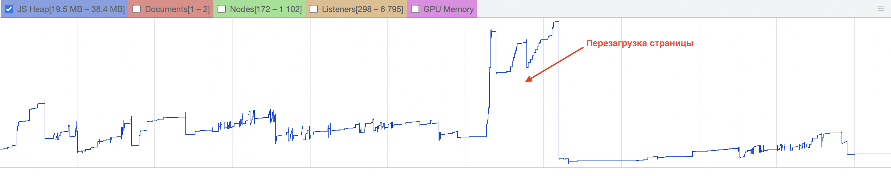
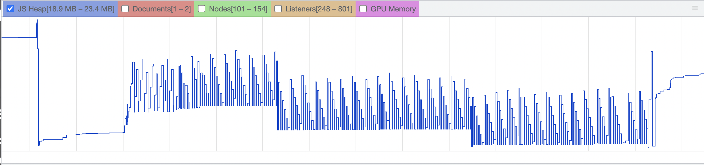

## Отчет по утечкам памяти

В приложении не наблюдается утечек памяти. В стандартном workflow память остается примерно на одном уровне. Это подтверждается результатами, приведенными на графике ниже. В данном случае, единственный скачок происходит при перезагрузке страницы.

В игре наблюдаются скачки памяти, но в данном случае это объясняется множественным rerender состояния игрового мира на canvas.

